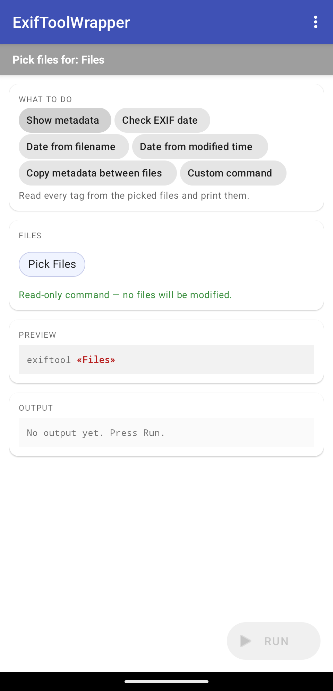

# ExifToolWrapper-Android

An unofficial Android wrapper around [ExifTool](https://exiftool.org/) that
runs it on-device using a Perl interpreter cross-compiled for Android.

The original motivation: on Pixel devices, screenshots and Snapchat images
arrive without EXIF timestamps, and Google Photos uses upload time as a
fallback rather than file modification time. This app embeds EXIF
`DateTimeOriginal` from either the filename (Android screenshots) or the
file modification date (Snapchat etc.) so Google Photos sorts them
correctly.

There is also an "advanced custom command" mode for arbitrary exiftool flags
when the presets aren't enough.



## Disclaimer

This app modifies — and in some modes overwrites — your photo files. **Make
backups.** See [`DISCLAIMER.md`](./DISCLAIMER.md) for the full warranty /
liability disclaimer; the app shows a condensed version on first launch
and again before enabling advanced mode.

## Usage

Install the latest signed APK from the
[Releases page](https://github.com/bestvibes/exiftoolwrapper-android/releases),
grant the storage permission on first launch, and pick files or a directory.

Pick the APK matching your device's ABI (most modern Android phones are
`arm64-v8a`); if unsure, the `universal` APK works on all four supported
ABIs at the cost of a larger download.

Each release ships with `SHA256SUMS` and a SLSA build-provenance
attestation. To verify what you downloaded was produced by this repo's CI
from a specific commit:

```bash
shasum -a 256 -c SHA256SUMS
gh attestation verify <apk> -R bestvibes/exiftoolwrapper-android
```

See [`RELEASING.md`](./RELEASING.md) for how releases are built and signed.

## Reproducible native build

Earlier versions of this app committed pre-built `perl_*.xz` and
`exiftool.xz` blobs straight into `app/src/main/res/raw/`. Those blobs had no
provenance and no update path, which was both a security concern and the
reason ExifTool was stuck at a 7-year-old release
([#2](https://github.com/bestvibes/exiftoolwrapper-android/issues/2)).

The current build pipeline replaces that with:

- [`native/PINS`](./native/PINS) — exact pinned versions and SHA256s for
  perl, ExifTool, perl-cross, and the Android NDK.
- [`native/build.sh`](./native/build.sh) — cross-builds perl with
  perl-cross in the standard configuration (DynaLoader enabled), runs
  `make install` to a staging tree, then renames the perl interpreter to
  `libperl.so` and each XS module to `libperl_xs_<flat_name>.so` so
  Android's installer ships them all via the standard `jniLibs`
  mechanism.
- [`.github/workflows/native.yml`](./.github/workflows/native.yml) — builds
  all four ABIs (`arm64-v8a`, `armeabi-v7a`, `x86_64`, `x86`) reproducibly
  on GitHub Actions, attaches SLSA build-provenance attestations, and opens
  a PR updating the in-tree binaries.

To verify a release:

1. Pull the APK and SHA256 the embedded `lib/<abi>/libperl.so` and any
   `lib/<abi>/libperl_xs_*.so`.
2. Compare against the SHA256s in the SLSA attestation attached to the
   matching `native-v*` GitHub release.
3. Compare against the bytes committed at
   `app/src/main/jniLibs/<abi>/lib*.so` in this repository.

All three should match. See [`native/README.md`](./native/README.md) for the
longer explanation of how the chain works.

## Runtime architecture

- `libperl.so` (the perl interpreter) and `libperl_xs_*.so` (one per XS
  module: `POSIX`, `Compress::Raw::Zlib`, `IO::Compress::*`, etc.) all live
  under `applicationInfo.nativeLibraryDir`, an exec mount populated by
  Android's installer at install time. No `chmod` needed; no W^X violation.
- `assets/perl5.tar` (the ExifTool script + `Image::ExifTool/` lib tree +
  perl's pure-perl `@INC`) is extracted to `filesDir/perl5/` on first
  launch via [`AssetExtractor`](./app/src/main/java/me/bestvibes/exiftoolwrapper/AssetExtractor.kt).
  `AssetExtractor` also creates symlinks at
  `filesDir/perl5/arch/auto/<dist>/<dist>.so` pointing to the matching
  `nativeLibraryDir/libperl_xs_*.so`, so perl's `DynaLoader` finds each XS
  module at the canonical archlib path. The symlinks are recreated on
  every launch because Android randomizes `nativeLibraryDir` across
  app installs.
- Every invocation is
  `ProcessBuilder(libperl.so, -I arch, -I lib, exiftool, …)` — argv list,
  no shell, no string interpolation.
- File handling: SAF picker URIs are copied to a per-run cache subdir
  (preserving the original filename, since some exiftool modes parse it),
  exiftool reads/writes the cache copy, and for write modes the result is
  copied back to the source URI via `openOutputStream("wt")`. The picker
  uses `ACTION_OPEN_DOCUMENT` so URIs come back with both read and write
  permission grants in one step.
- The custom-command field is sanitized by
  [`CommandSanitizer`](./app/src/main/java/me/bestvibes/exiftoolwrapper/CommandSanitizer.kt),
  which blocks the small set of exiftool flags that can load arbitrary
  Perl (`-config`, `-@`, `-stay_open`, `-execute*`).
- Every executed command is appended to `filesDir/command_history.txt` for
  audit (capped at 1 MB).

## Credits

- Build pipeline approach borrowed from [Termux](https://termux.com/)
  (the `lib*.so` jniLibs trick for shipping executables).
- Cross-compilation by [perl-cross](https://github.com/arsv/perl-cross).
- ExifTool by [Phil Harvey](https://exiftool.org/).
